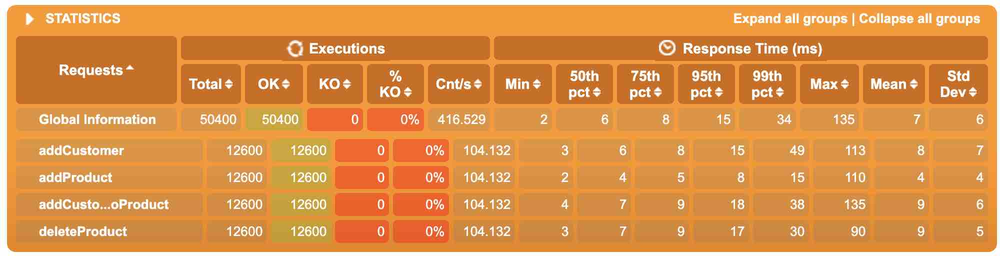
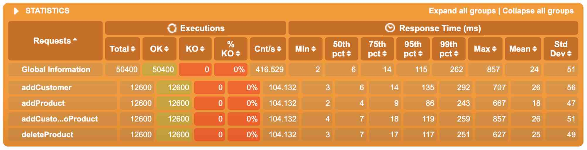
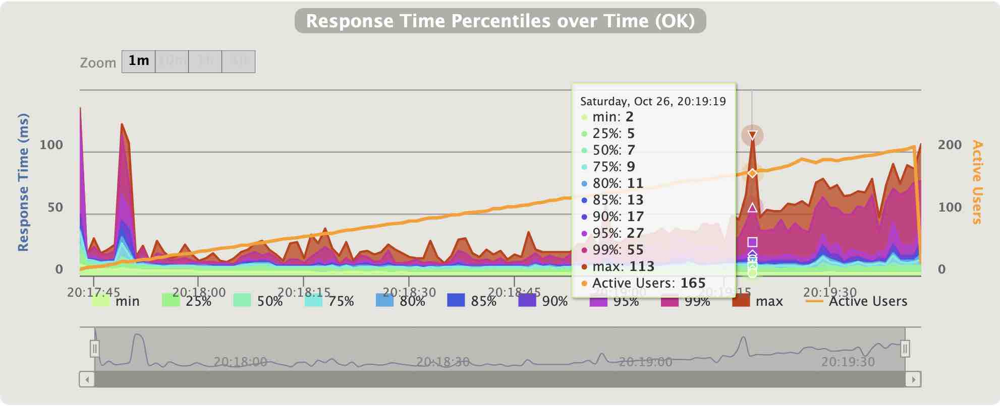
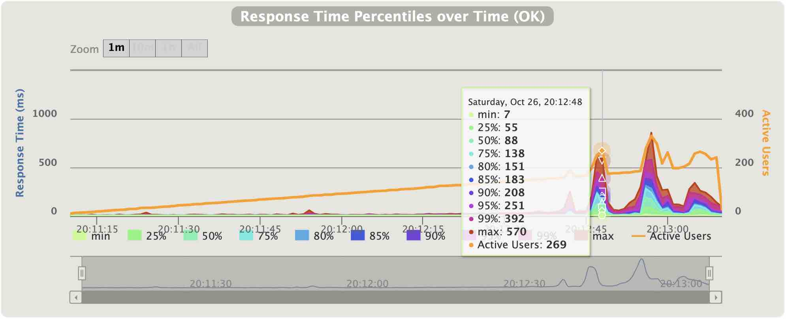

# Demo Spring boot web application with persistence

# Quick start
 - To start the application run: `./quick_start.sh`

# Test
 - unit test
 ```
./gradlew cleanTest test
```
- integration test
```
./gradlew cleanTest integrationTest
```

# Start in docker container
- build docker image
    ```
    ./gradlew buildDockerImage
    ```
- start docker compose (web application and database)
    ```
    docker-compose -f ./deploy/docker-compose.yml up -d
    ```
- stop docker compose
    ```
    docker-compose -f ./deploy/docker-compose.yml down -v
    ```
# DB migration
```
./gradlew -Dflyway.configFiles=flyway/flyway.config flywayMigrate -i
```

# Jetty vs Tomcat performance comparison
Load test is done using gatling project here: https://github.com/zoomout/gatling-web-test 

Jetty percentiles table

Tomcat percentiles table

Jetty percentiles graph

Tomcat percentiles graph

